# Alura Geek

Projeto desenvolvido como desafio do curso **"Praticando Front End: Challenge AluraGeek"** para o programa **ONE - Oracle Next Education**, uma parceria entre a **Oracle Corporation** e a **Alura**.

O objetivo foi criar um site utilizando **HTML**, **CSS** e **JavaScript**, implementando funcionalidades de **CRUD** para gerenciar produtos de uma loja geek.

## 💻 Como executar o projeto

### Pré-requisitos

-   **Node.js**: Certifique-se de que o Node.js está instalado em sua máquina. [Baixe aqui](https://nodejs.org/).
-   **Gerenciador de pacotes npm**: Já incluído no Node.js.
-   **JSON-Server**: Simula uma API para operações CRUD.
-   **Live Server**: Inicia o servidor para hospedar o site localmente.

### Passo a passo

1. **Clone o repositório**

    ```bash
    git clone https://github.com/rafaelmaia23/alura-geek.git
    cd alura-geek
    ```

2. **Instale o JSON-Server**

    ```bash
    npm install -g json-server
    ```

3. **Inicie o JSON-Server**  
   Certifique-se de estar na pasta do projeto e execute:

    ```bash
    npm run startDb
    ```

    Isso iniciará a API na porta `http://localhost:3000`.

4. **Instale o Live Server**  
   Caso ainda não tenha instalado o Live Server globalmente, execute:

    ```bash
    npm install -g live-server
    ```

5. **Inicie o Live Server**  
   Na raiz do projeto, execute:
    ```bash
    live-server --entry-file=index.html
    ```
    O site será iniciado no navegador padrão.

## 📱 Preview

O site é totalmente responsivo, adaptando-se para **PC**, **tablet** e **smartphone**.

### Versão PC

<div style="display: flex; flex-wrap: wrap; gap: 1rem;">
   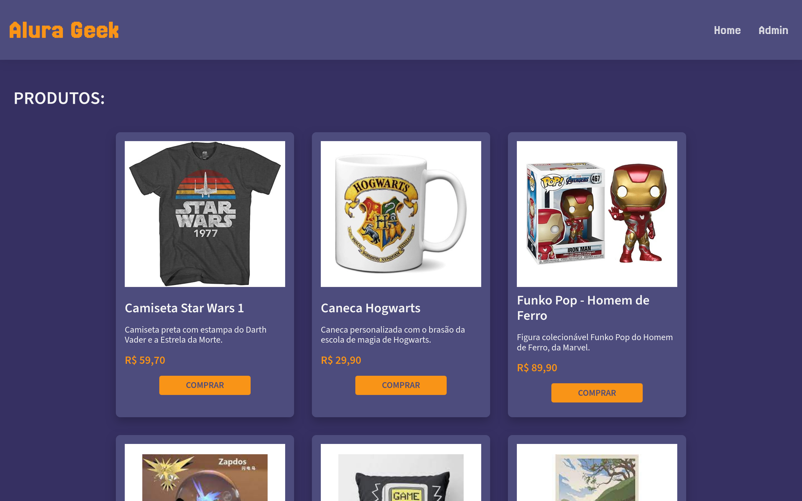
   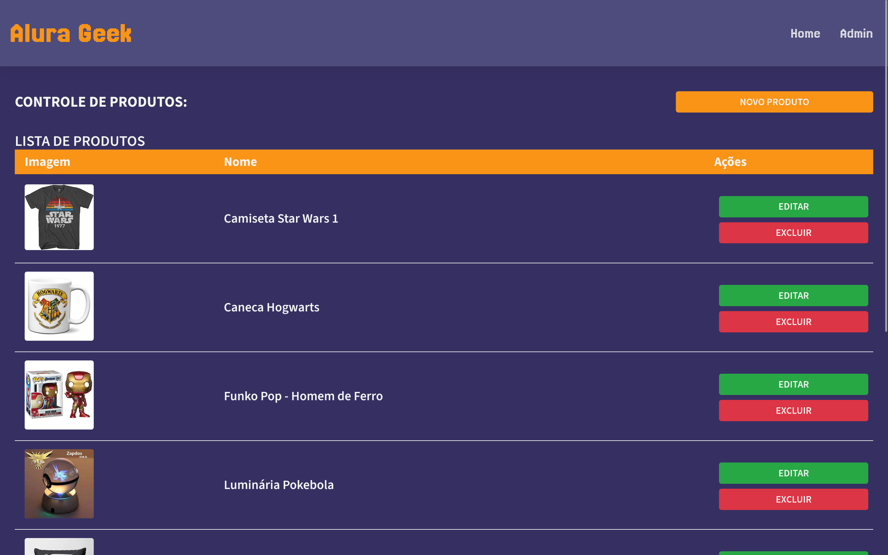
   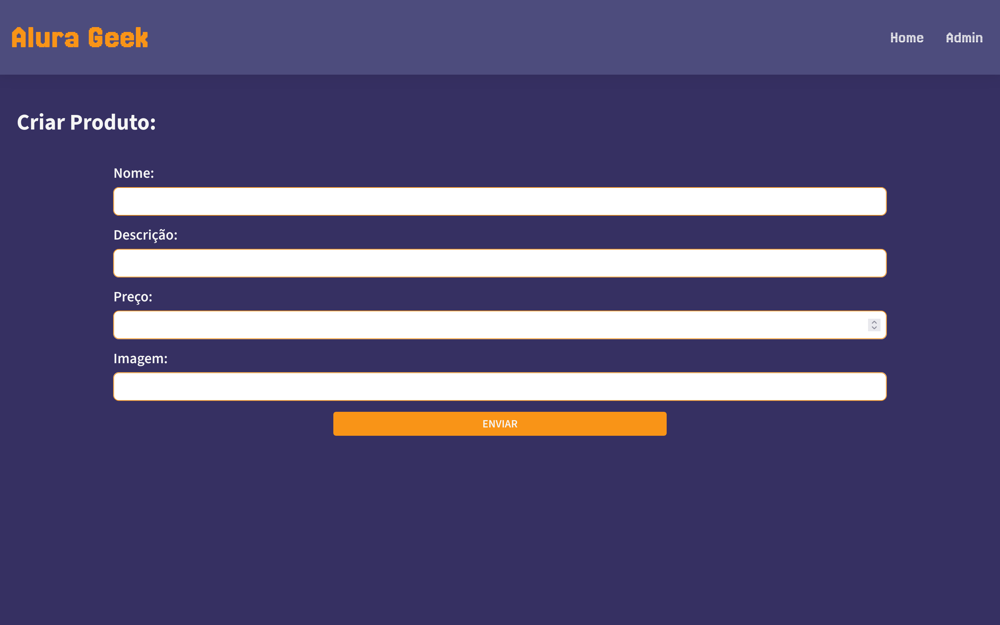
   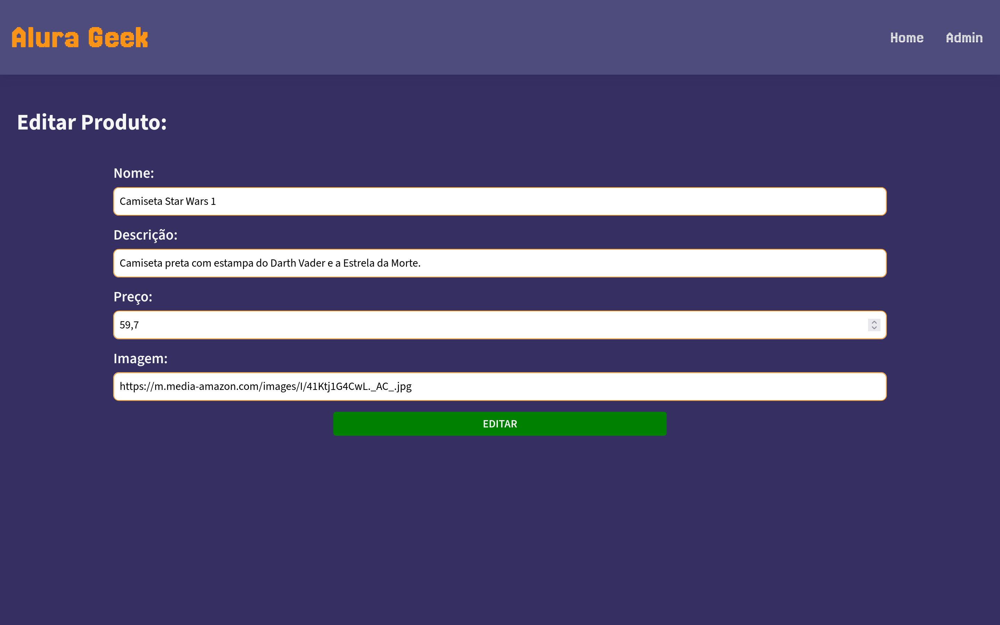
   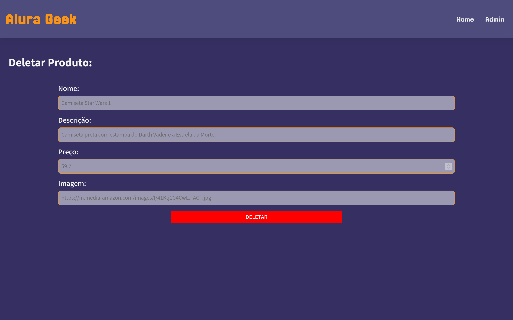
</div>

### Versão Tablet

<div style="display: flex; flex-wrap: wrap; gap: 1rem;">
    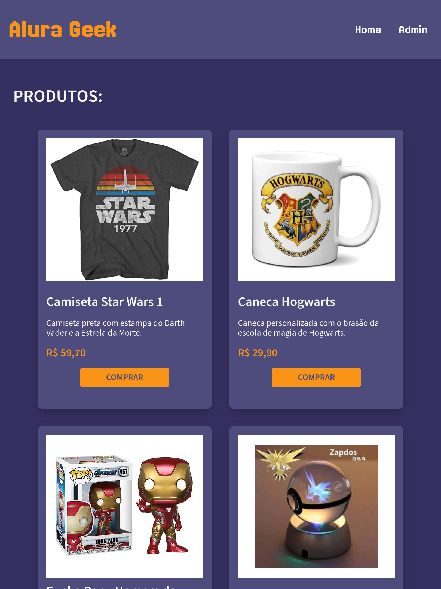
    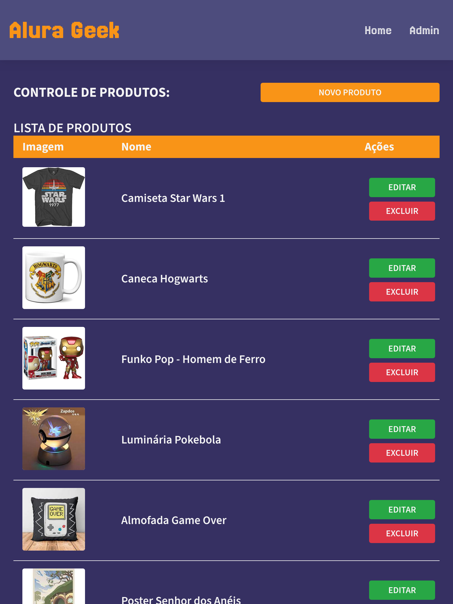
    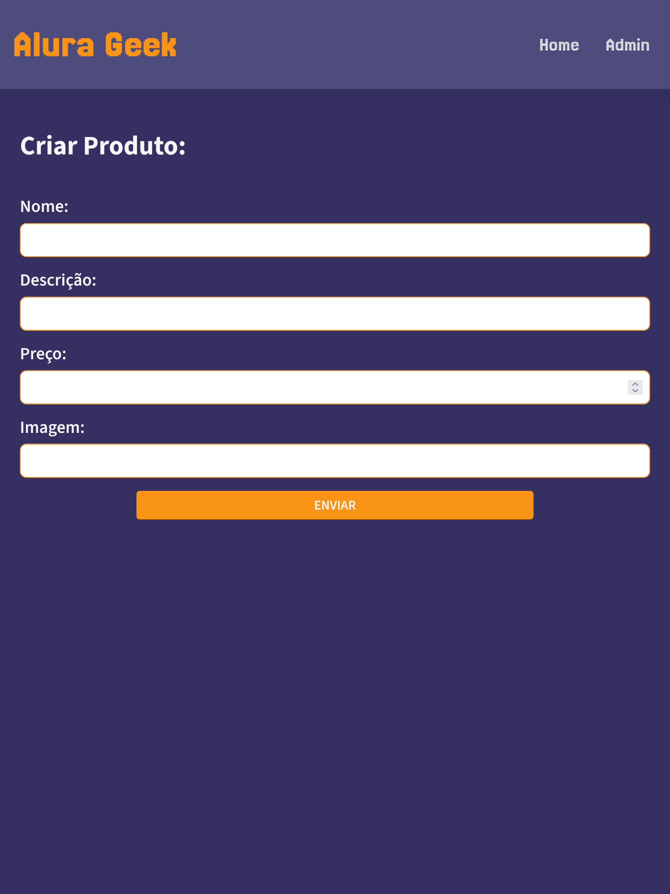
    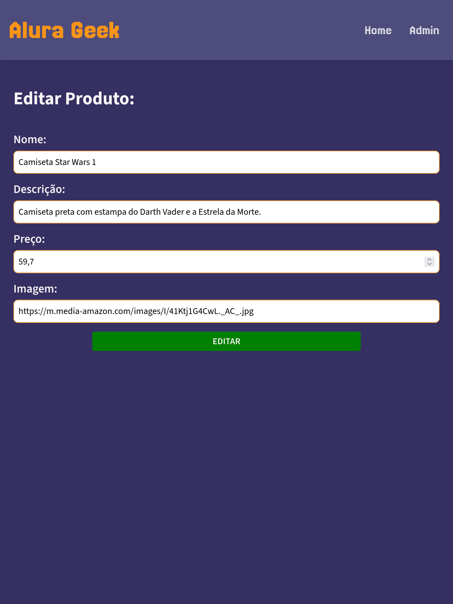
    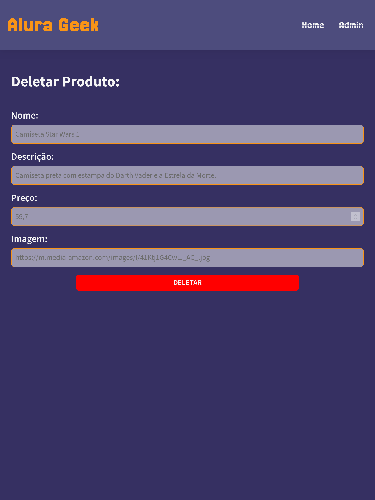
</div>

### Versão Smartphone

<div style="display: flex; flex-wrap: wrap; gap: 1rem;">
   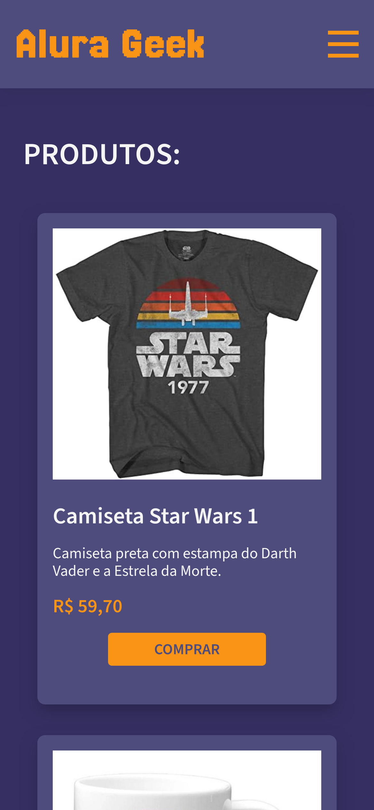
   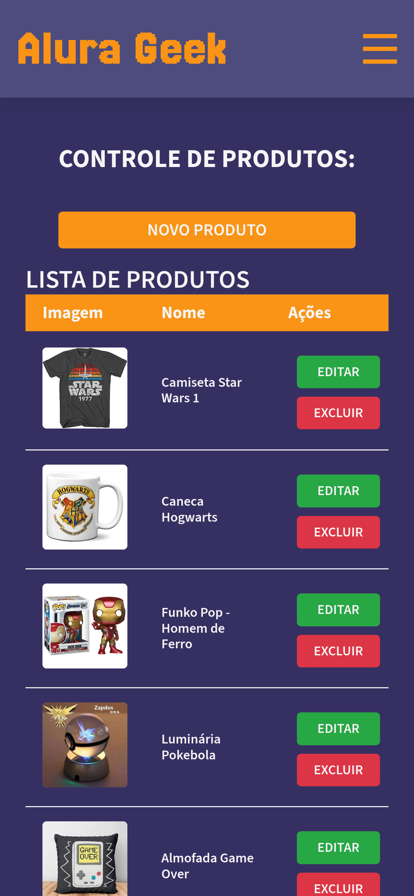
   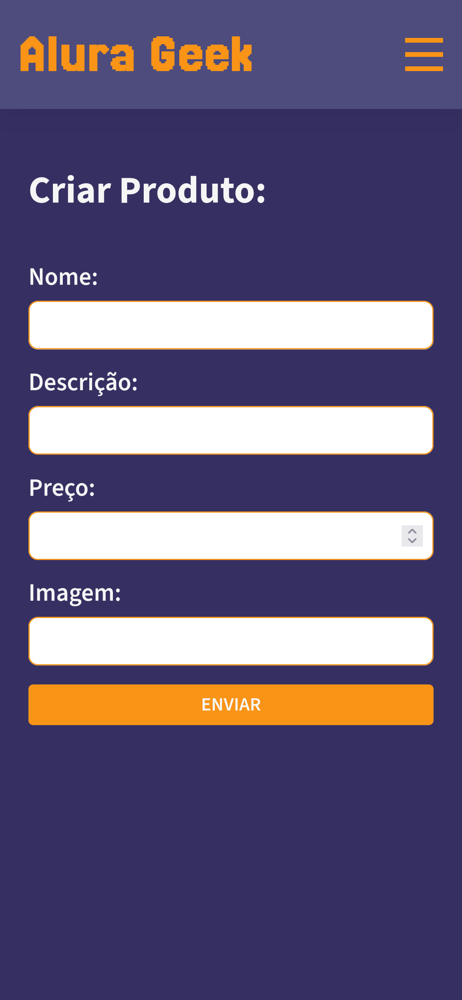
   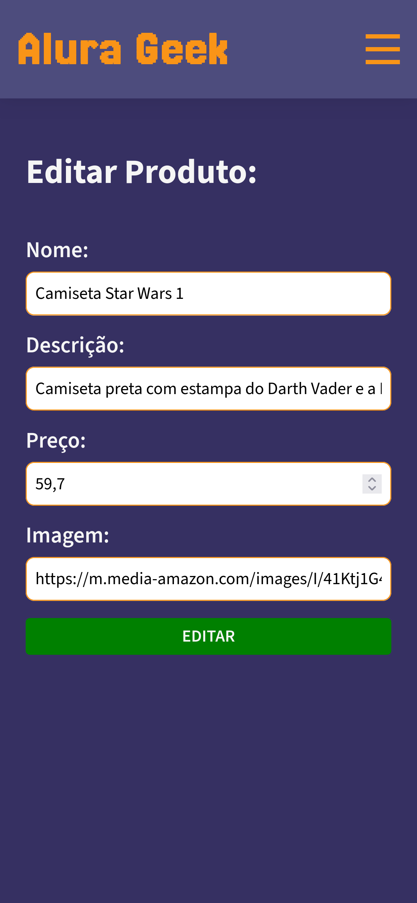
   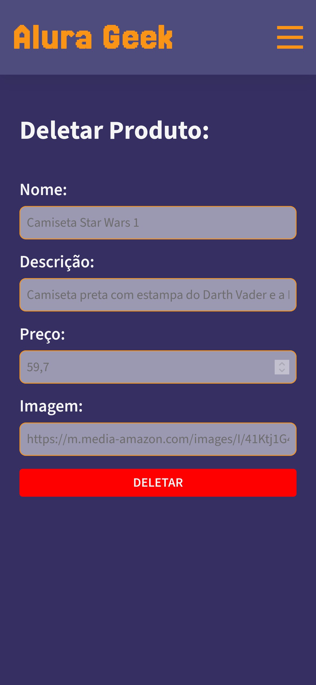
</div>

---

### 📚 Criado por Rafael Maia

-   GitHub: [rafaelmaia23](https://github.com/rafaelmaia23)
-   LinkedIn: [Rafael Maia da Fonseca](https://www.linkedin.com/in/rafaelmaiadafonseca/)
